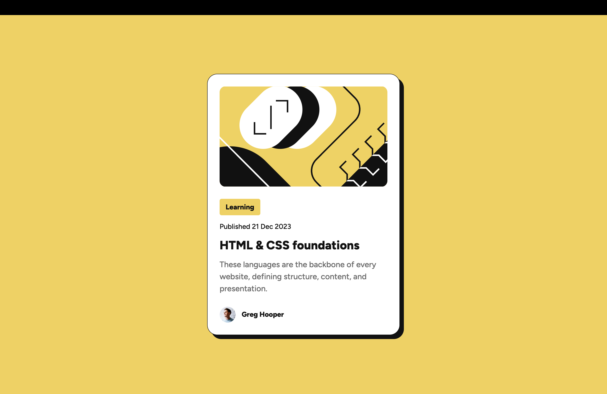

# Frontend Mentor - Blog preview card solution

This is a solution to the [Blog preview card challenge on Frontend Mentor](https://www.frontendmentor.io/challenges/blog-preview-card-ckPaj01IcS). Frontend Mentor challenges help you improve your coding skills by building realistic projects. 

## Table of contents

- [Overview](#overview)
  - [The challenge](#the-challenge)
  - [Screenshot](#screenshot)
  - [Links](#links)
- [My process](#my-process)
  - [Built with](#built-with)
  - [What I learned](#what-i-learned)
  - [Continued development](#continued-development)
  - [Useful resources](#useful-resources)
- [Author](#author)
- [Acknowledgments](#acknowledgments)

## Overview

### The challenge

Users should be able to:

- See hover and focus states for all interactive elements on the page

### Screenshot



This screenshot shows the final result of my solution, matching the mobile and desktop designs provided in the challenge.

### Links

- Solution URL: [](https://www.frontendmentor.io/solutions/blog-preview-card-using-semantic-html-and-flexbox-IMrf4dUuZn)
- Live Site URL: [](https://reemabahabri.github.io/blog-preview-card/)

## My process

### Built with

- Semantic HTML5 markup
- CSS custom properties
- Flexbox
- Mobile-first workflow

### What I learned

This challenge helped me improve how I approach layout and spacing in CSS.

One key decision was choosing **Flexbox** instead of Grid, since the card content flows in one vertical direction. I also relied on `gap` to control spacing between elements, rather than adding margins everywhere.

```css
.card {
  display: flex;
  flex-direction: column;
  gap: 12px;
}

```
This approach keeps spacing logic inside the container, makes the layout easier to maintain, and allows quick adjustments without touching individual elements.

I also practiced:

- Writing semantic HTML before styling
- Following a mobile-first workflow
- Implementing hover and focus states to improve accessibility

## Continued development

In future projects, I want to continue focusing on:

- Improving my spacing and typography decisions
- Writing cleaner and more maintainable CSS
- Becoming more confident in choosing between Flexbox and Grid
- Completing more Frontend Mentor challenges to strengthen my front-end fundamentals

## Useful resources

- **MDN Web Docs – Flexbox**  
  Helped me understand Flexbox behavior and layout patterns.

- **Frontend Mentor Community**  
  Useful for reviewing other solutions and learning different approaches.

## Author

- GitHub: https://github.com/ReemaBahabri  
- Frontend Mentor: https://www.frontendmentor.io/profile/ReemaBahabri

## Acknowledgments

Thanks to Frontend Mentor for providing beginner-friendly challenges that encourage hands-on learning and practical experience.
